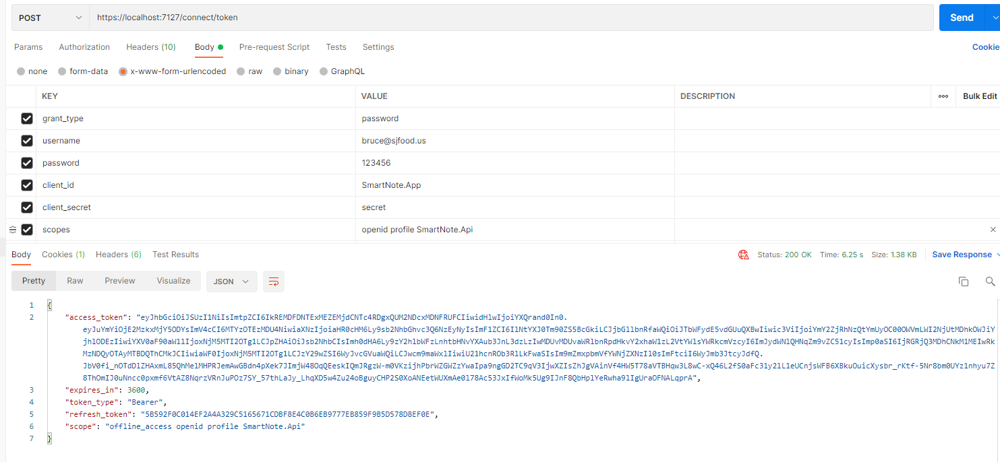

# Notex
A Note/Blog application based on .NET 6 with CQRS, EventSourcing, Domain Driver Design

## References

- [Domain-Driven Design Reference - Eric Evans](https://www.domainlanguage.com/ddd/reference/)
- [Implementing Domain-Driven Design - Vaughn Vernon](https://github.com/VaughnVernon/IDDD_Samples)
- [Clean Architecture](https://blog.cleancoder.com/uncle-bob/2012/08/13/the-clean-architecture.html)
- [kgrzybek/modular-monolith-with-ddd](https://github.com/kgrzybek/modular-monolith-with-ddd)
- [eShopOnContainers](https://github.com/dotnet-architecture/eShopOnContainers)

## How to Run

- Download and install .NET 6.0.0 or higher SDK 
- Download and install PostgreSQL
- Configure ConnectionStrings in appsettings.json
```json
{
  "ConnectionStrings": {
    "PostgreSQL": "host=localhost;database=notex;password=123123123;username=test;"
  }
}
```


## Authenticate

- [Resource Owner Password Grant Type](https://www.oauth.com/oauth2-servers/access-tokens/password-grant/)

**Example Postman for an Access Token:**


Using the HTTP request header `Authorization: Bearer <access_token>`

## License

MIT license